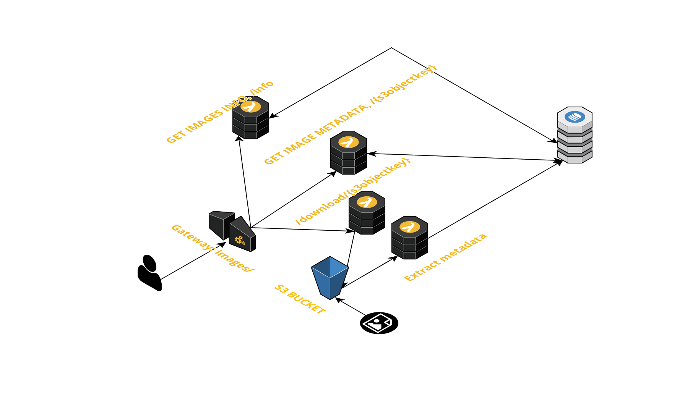

# serverless-challenge
Build a serverless architecture for image analysis

## Executar offline

```properties
npm install 
```
O seguinte comando vai criar o diretório .dynamodb em que o banco vai ser executado em memória durante a execução offline.
```properties
sls dynamodb install 
```
Executa localmente e cria na raiz do disco uma pasta temporária para simular o s3 e bucket.
```properties
sls offline start
```

## Gerar package
```properties
npm install
```

```properties
sls package
```

## endpoint

- images
    - /{s3objectkey}, método: GET, retorna o metadata de uma imagem específica 
    - /info, método: GET, executa um scan no database e retorna informações sobre as imagens salvas no bucket.
    - /download/{s3objectKey}, método: GET, redireciona para uma url gerada, caso a imagem esteja presente no bucket


## Esboço apresentado


## Arquitetura final

